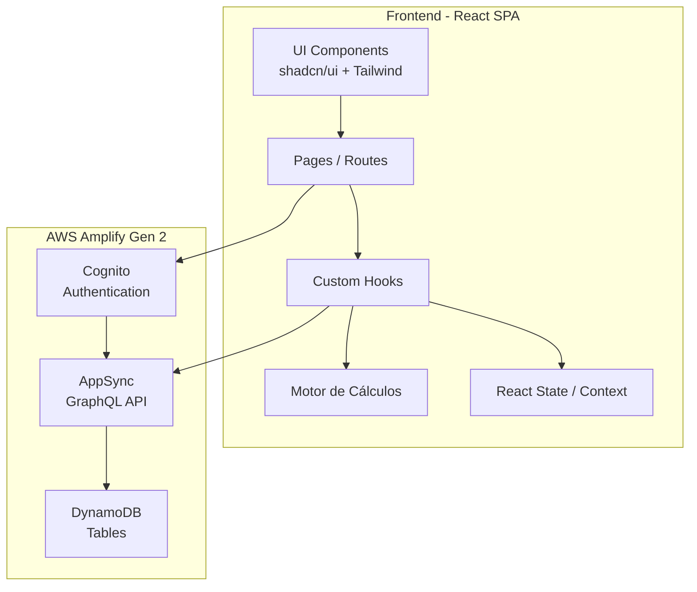
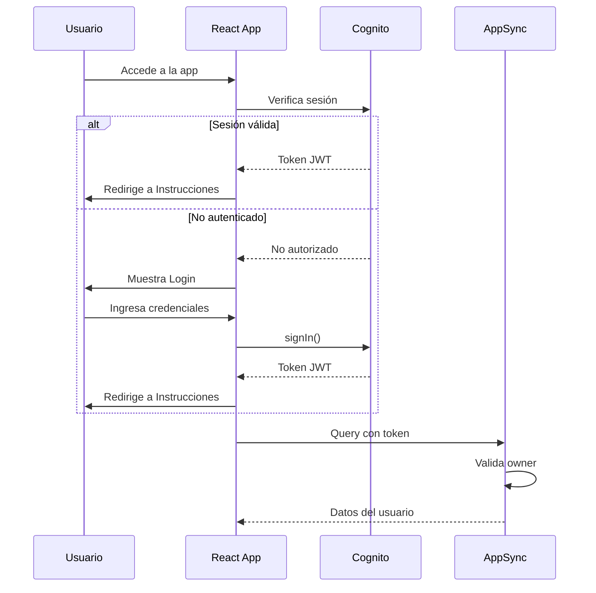
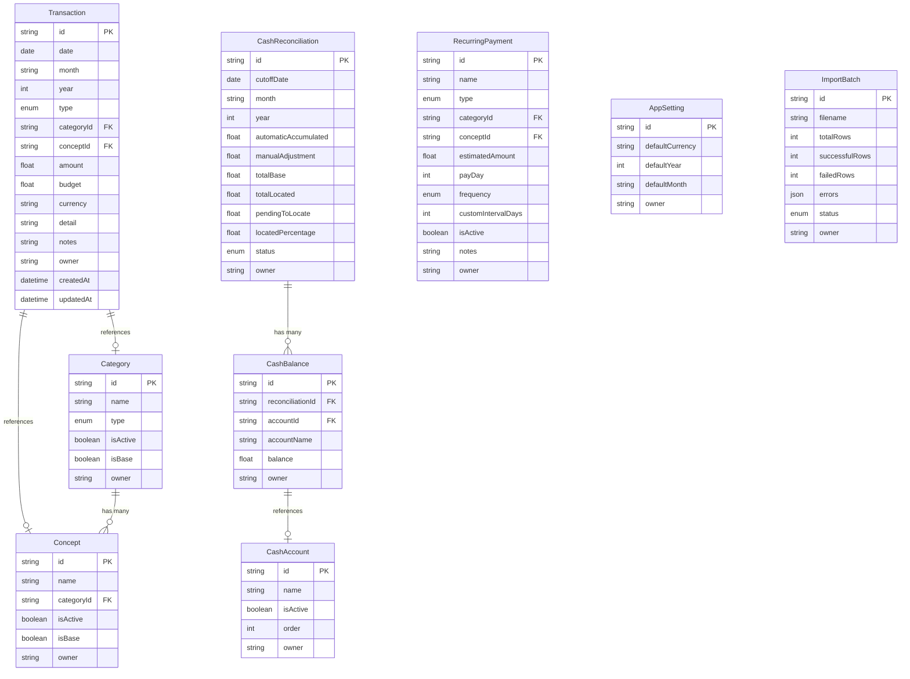

# Design Document - Finanzas Personales

## Overview

Finanzas Personales es una aplicación web fullstack de gestión financiera personal que reemplaza flujos basados en hojas de cálculo. La aplicación permite a usuarios autenticados registrar transacciones (ingresos/egresos), visualizar dashboards financieros, analizar flujo de caja, conciliar saldos bancarios, gestionar pagos recurrentes y administrar catálogos de clasificación.

### Decisiones de Diseño Clave

1. **Single Page Application (SPA)** con React + TypeScript + Vite para experiencia fluida sin recargas de página
2. **AWS Amplify Gen 2** como backend serverless (Cognito para auth, DynamoDB para datos, AppSync/GraphQL para API)
3. **Motor de cálculos puro** centralizado en funciones TypeScript sin efectos secundarios para consistencia y testabilidad
4. **Autorización basada en propietario** a nivel de modelo de datos (Amplify owner-based auth)
5. **Procesamiento de importación en cliente** para archivos CSV/Excel con validación por fila
6. **Componentes UI con shadcn/ui + Tailwind CSS** para diseño consistente y responsive

## Architecture

### Diagrama de Arquitectura de Alto Nivel



### Diagrama de Flujo de Autenticación



### Estructura de Carpetas del Proyecto

```
src/
├── amplify/
│   ├── auth/
│   │   └── resource.ts          # Configuración Cognito
│   ├── data/
│   │   └── resource.ts          # Schema DynamoDB/AppSync
│   └── backend.ts               # Entry point Amplify
├── components/
│   ├── ui/                      # shadcn/ui components
│   ├── layout/
│   │   ├── Sidebar.tsx
│   │   ├── AppLayout.tsx
│   │   └── MobileNav.tsx
│   ├── transactions/
│   │   ├── TransactionForm.tsx
│   │   ├── TransactionTable.tsx
│   │   └── TransactionFilters.tsx
│   ├── dashboard/
│   │   ├── KPICards.tsx
│   │   ├── DonutChart.tsx
│   │   ├── BarChart.tsx
│   │   └── MonthlyTrendChart.tsx
│   ├── cashflow/
│   │   ├── CashFlowTable.tsx
│   │   └── CashFlowCharts.tsx
│   ├── reconciliation/
│   │   ├── ReconciliationForm.tsx
│   │   └── AccountBalances.tsx
│   ├── catalogs/
│   │   └── CatalogManager.tsx
│   ├── analysis/
│   │   ├── PivotTable.tsx
│   │   └── AnalysisCharts.tsx
│   ├── recurring/
│   │   ├── RecurringForm.tsx
│   │   └── RecurringList.tsx
│   └── import-export/
│       ├── CSVExporter.tsx
│       ├── FileImporter.tsx
│       └── ImportPreview.tsx
├── hooks/
│   ├── useTransactions.ts
│   ├── useCatalogs.ts
│   ├── useDashboard.ts
│   ├── useCashFlow.ts
│   ├── useReconciliation.ts
│   ├── useRecurringPayments.ts
│   ├── useAppSettings.ts
│   └── useImportExport.ts
├── lib/
│   ├── calculations/
│   │   ├── engine.ts            # Motor de cálculos principal
│   │   ├── totals.ts            # Funciones de totales
│   │   ├── cashflow.ts          # Funciones de flujo de caja
│   │   ├── distribution.ts     # Funciones de distribución
│   │   ├── reconciliation.ts   # Funciones de conciliación
│   │   └── types.ts            # Tipos del motor
│   ├── validators/
│   │   ├── transaction.ts
│   │   ├── catalog.ts
│   │   ├── recurring.ts
│   │   └── import.ts
│   ├── export/
│   │   └── csv.ts
│   └── utils/
│       ├── dates.ts
│       ├── formatting.ts
│       └── constants.ts
├── pages/
│   ├── LoginPage.tsx
│   ├── InstructionsPage.tsx
│   ├── TransactionEntryPage.tsx
│   ├── DataTablePage.tsx
│   ├── DashboardPage.tsx
│   ├── CashFlowPage.tsx
│   ├── ReconciliationPage.tsx
│   ├── CatalogPage.tsx
│   ├── AnalysisPage.tsx
│   └── RecurringPage.tsx
├── contexts/
│   ├── AuthContext.tsx
│   └── SettingsContext.tsx
├── App.tsx
└── main.tsx
```

## Components and Interfaces

### 1. Módulo de Autenticación

**Componentes:**
- `LoginPage`: Página con formulario de login usando `Authenticator` de Amplify UI
- `AuthContext`: Context de React que provee estado de autenticación y funciones de sesión
- `ProtectedRoute`: HOC que valida sesión activa antes de renderizar rutas protegidas

**Interfaces:**

```typescript
interface AuthState {
  user: AuthUser | null;
  isAuthenticated: boolean;
  isLoading: boolean;
}

interface AuthContextValue extends AuthState {
  signOut: () => Promise<void>;
}
```

### 2. Módulo de Navegación

**Componentes:**
- `AppLayout`: Layout principal con sidebar y área de contenido
- `Sidebar`: Barra lateral con links de navegación, highlights activos
- `MobileNav`: Menú hamburguesa para viewports ≤768px

**Interfaces:**

```typescript
interface NavItem {
  label: string;
  path: string;
  icon: LucideIcon;
}

interface SidebarProps {
  items: NavItem[];
  currentPath: string;
  onNavigate: (path: string) => void;
}
```

### 3. Módulo de Transacciones

**Componentes:**
- `TransactionForm`: Formulario con campos dependientes (tipo→categoría→concepto)
- `TransactionTable`: Tabla paginada con búsqueda, filtros, ordenamiento y totales
- `TransactionFilters`: Panel de filtros por mes, año, tipo, categoría, concepto
- `EditTransactionDialog`: Diálogo modal para edición inline

**Interfaces:**

```typescript
interface TransactionFormData {
  date: string;              // ISO date string
  type: 'Ingreso' | 'Egreso';
  categoryId: string;
  conceptId: string;
  detail?: string;           // max 100 chars
  budget?: number;           // 0.01 - 999,999,999.99
  amount: number;            // 0.01 - 999,999,999.99
  currency: string;
  notes?: string;            // max 500 chars
}

interface TransactionRecord extends TransactionFormData {
  id: string;
  month: string;
  year: number;
  owner: string;
  createdAt: string;
  updatedAt: string;
}

interface TableFilters {
  search: string;
  month?: string;
  year?: number;
  type?: 'Ingreso' | 'Egreso';
  categoryId?: string;
  conceptId?: string;
}

interface TableTotals {
  totalIncome: number;
  totalExpense: number;
  balance: number;
}
```

### 4. Módulo de Exportación/Importación

**Componentes:**
- `CSVExporter`: Botón que genera y descarga CSV de registros filtrados
- `FileImporter`: Componente de carga de archivos con validación
- `ImportPreview`: Vista previa de primeros 10 registros antes de confirmar

**Interfaces:**

```typescript
interface ExportOptions {
  records: TransactionRecord[];
  columns: string[];
  filename: string;
}

interface ImportValidationResult {
  isValid: boolean;
  errors: ImportError[];
  preview: ParsedRow[];
  totalRows: number;
}

interface ImportError {
  row: number;
  field: string;
  message: string;
}

interface ImportResult {
  totalProcessed: number;
  successful: number;
  failed: number;
  errors: ImportError[];
}
```

### 5. Módulo de Dashboard

**Componentes:**
- `KPICards`: Grid de tarjetas con métricas financieras
- `DonutChart`: Gráfica de dona para distribución de egresos por categoría
- `IncomeExpenseBar`: Gráfica de barras comparativa ingresos vs egresos
- `MonthlyTrendChart`: Evolución mensual de ingresos y egresos

**Interfaces:**

```typescript
interface DashboardKPIs {
  totalIncome: number;
  totalExpense: number;
  monthlyBalance: number;
  incomeBudget: number;
  expenseBudget: number;
  incomeBudgetDiff: number;
  expenseBudgetDiff: number;
  expensePercentage: number;
}

interface CategoryDistribution {
  category: string;
  amount: number;
  percentage: number;
}

interface DashboardFilters {
  month: string;
  year: number;
  currency: string;
}
```

### 6. Módulo de Flujo de Caja

**Componentes:**
- `CashFlowTable`: Tabla con 12 columnas (meses) y filas de métricas
- `CashFlowCharts`: Gráficas de línea (acumulado) y barras (mensual)

**Interfaces:**

```typescript
interface MonthlyFlow {
  month: string;
  income: number;
  expense: number;
  expensePercentage: number;
  monthlyFlow: number;
  cumulativeFlow: number;
}

interface CashFlowData {
  year: number;
  months: MonthlyFlow[];
}
```

### 7. Módulo de Conciliación

**Componentes:**
- `ReconciliationForm`: Formulario principal de conciliación
- `AccountBalances`: Lista editable de cuentas con saldos
- `ReconciliationStatus`: Indicador visual del estado de cuadre
- `DistributionChart`: Gráfica de distribución por cuenta

**Interfaces:**

```typescript
interface ReconciliationData {
  cutoffDate: string;
  month: string;
  year: number;
  automaticAccumulated: number;
  manualAdjustment: number;
  totalBase: number;
  totalLocated: number;
  pendingToLocate: number;
  locatedPercentage: number;
  status: 'Cuadrado' | 'Falta ubicar' | 'Sobra';
}

interface AccountBalance {
  accountId: string;
  accountName: string;
  balance: number;
  isActive: boolean;
}
```

### 8. Módulo de Catálogos

**Componentes:**
- `CatalogManager`: Página con tabs/secciones para cada catálogo
- `CatalogSection`: Sección genérica con CRUD para items de catálogo
- `CatalogItemForm`: Formulario inline para agregar/editar items

**Interfaces:**

```typescript
interface CatalogItem {
  id: string;
  name: string;
  isActive: boolean;
  isBase: boolean;        // No se puede eliminar
  parentId?: string;      // Para categorías→tipo, conceptos→categoría
  type?: 'Ingreso' | 'Egreso';
}

interface CatalogSection {
  title: string;
  items: CatalogItem[];
  allowAdd: boolean;
  allowDelete: boolean;
  parentField?: string;
}
```

### 9. Módulo de Análisis

**Componentes:**
- `PivotTable`: Tabla pivot con agrupación multidimensional
- `AnalysisFilters`: Filtros de dimensiones y rango de fechas
- `AnalysisCharts`: Gráfica de barras presupuesto vs real

**Interfaces:**

```typescript
interface AnalysisConfig {
  dimensions: ('month' | 'year' | 'type' | 'category' | 'concept')[];
  dateRange: { start: string; end: string };
}

interface PivotRow {
  dimensions: Record<string, string>;
  budgetTotal: number;
  amountTotal: number;
  executionPercentage: number;
}
```

### 10. Módulo de Pagos Recurrentes

**Componentes:**
- `RecurringForm`: Formulario de registro con campos dependientes
- `RecurringList`: Lista con acciones (generar, editar, eliminar)
- `GenerateDialog`: Diálogo de confirmación para generar transacción

**Interfaces:**

```typescript
interface RecurringPayment {
  id: string;
  name: string;              // max 100 chars
  type: 'Ingreso' | 'Egreso';
  categoryId: string;
  conceptId: string;
  estimatedAmount: number;   // 0.01 - 999,999,999.99
  payDay: number;            // 1-31
  frequency: 'mensual' | 'quincenal' | 'anual' | 'personalizada';
  customIntervalDays?: number; // 1-365
  isActive: boolean;
  notes?: string;            // max 500 chars
  owner: string;
  createdAt: string;
  updatedAt: string;
}
```

### 11. Motor de Cálculos

**Diseño:** Módulo de funciones puras TypeScript sin dependencias externas ni efectos secundarios. Cada función recibe datos como parámetro y retorna un resultado numérico o estructura de datos.

**Interfaces:**

```typescript
// Tipo de entrada estándar
interface CalculationTransaction {
  type: 'Ingreso' | 'Egreso';
  amount: number;
  budget?: number;
  category?: string;
  month?: string;
  year?: number;
}

// Funciones principales del motor
type CalcFn = (transactions: CalculationTransaction[]) => number;
type DistFn = (transactions: CalculationTransaction[]) => CategoryDistribution[];

// Funciones exportadas
export function totalIncome(transactions: CalculationTransaction[]): number;
export function totalExpense(transactions: CalculationTransaction[]): number;
export function balance(transactions: CalculationTransaction[]): number;
export function monthlyFlow(transactions: CalculationTransaction[], month: string): number;
export function cumulativeFlow(transactions: CalculationTransaction[], upToMonth: string): number;
export function categoryDistribution(transactions: CalculationTransaction[]): CategoryDistribution[];
export function executionPercentage(budget: number, actual: number): number;
export function safeDiv(numerator: number, denominator: number): number;
export function sanitizeAmount(value: unknown): number;
```

## Data Models

### Amplify Gen 2 Schema

```typescript
// amplify/data/resource.ts
import { type ClientSchema, a, defineData } from '@aws-amplify/backend';

const schema = a.schema({
  Transaction: a.model({
    date: a.date().required(),
    month: a.string().required(),
    year: a.integer().required(),
    type: a.enum(['Ingreso', 'Egreso']),
    categoryId: a.id().required(),
    categoryName: a.string().required(),
    conceptId: a.id().required(),
    conceptName: a.string().required(),
    detail: a.string(),
    budget: a.float(),
    amount: a.float().required(),
    currency: a.string().required(),
    notes: a.string(),
  }).authorization(allow => [allow.owner()]),

  Category: a.model({
    name: a.string().required(),
    type: a.enum(['Ingreso', 'Egreso']),
    isActive: a.boolean().required().default(true),
    isBase: a.boolean().required().default(false),
    concepts: a.hasMany('Concept', 'categoryId'),
  }).authorization(allow => [allow.owner()]),

  Concept: a.model({
    name: a.string().required(),
    categoryId: a.id().required(),
    category: a.belongsTo('Category', 'categoryId'),
    isActive: a.boolean().required().default(true),
    isBase: a.boolean().required().default(false),
  }).authorization(allow => [allow.owner()]),

  CashAccount: a.model({
    name: a.string().required(),
    isActive: a.boolean().required().default(true),
    order: a.integer(),
  }).authorization(allow => [allow.owner()]),

  CashReconciliation: a.model({
    cutoffDate: a.date().required(),
    month: a.string().required(),
    year: a.integer().required(),
    automaticAccumulated: a.float().required(),
    manualAdjustment: a.float().required().default(0),
    totalBase: a.float().required(),
    totalLocated: a.float().required(),
    pendingToLocate: a.float().required(),
    locatedPercentage: a.float().required(),
    status: a.enum(['Cuadrado', 'FaltaUbicar', 'Sobra']),
    balances: a.hasMany('CashBalance', 'reconciliationId'),
  }).authorization(allow => [allow.owner()]),

  CashBalance: a.model({
    reconciliationId: a.id().required(),
    reconciliation: a.belongsTo('CashReconciliation', 'reconciliationId'),
    accountId: a.id().required(),
    accountName: a.string().required(),
    balance: a.float().required(),
  }).authorization(allow => [allow.owner()]),

  RecurringPayment: a.model({
    name: a.string().required(),
    type: a.enum(['Ingreso', 'Egreso']),
    categoryId: a.id().required(),
    categoryName: a.string().required(),
    conceptId: a.id().required(),
    conceptName: a.string().required(),
    estimatedAmount: a.float().required(),
    payDay: a.integer().required(),
    frequency: a.enum(['mensual', 'quincenal', 'anual', 'personalizada']),
    customIntervalDays: a.integer(),
    isActive: a.boolean().required().default(true),
    notes: a.string(),
  }).authorization(allow => [allow.owner()]),

  AppSetting: a.model({
    defaultCurrency: a.string().required().default('COP'),
    defaultYear: a.integer().required(),
    defaultMonth: a.string().required(),
  }).authorization(allow => [allow.owner()]),

  ImportBatch: a.model({
    filename: a.string().required(),
    totalRows: a.integer().required(),
    successfulRows: a.integer().required(),
    failedRows: a.integer().required(),
    errors: a.json(),
    status: a.enum(['completed', 'partial', 'failed']),
  }).authorization(allow => [allow.owner()]),
});

export type Schema = ClientSchema<typeof schema>;
export const data = defineData({ schema });
```

### Diagrama de Relaciones



### Patrones de Acceso a DynamoDB

| Operación | Entidad | Patrón | Filtros |
|-----------|---------|--------|---------|
| Listar transacciones | Transaction | Query por owner | month, year, type, category |
| Buscar transacciones | Transaction | Scan con filtro | text search en detail, notes |
| Obtener catálogos | Category, Concept | Query por owner | type, isActive |
| Flujo de caja | Transaction | Query por owner + year | currency = default |
| Conciliación | CashReconciliation | Query por owner | month, year |
| Pagos recurrentes | RecurringPayment | Query por owner | isActive |
| Settings | AppSetting | Query por owner | - |

## Correctness Properties

*A property is a characteristic or behavior that should hold true across all valid executions of a system — essentially, a formal statement about what the system should do. Properties serve as the bridge between human-readable specifications and machine-verifiable correctness guarantees.*

### Property 1: Safe Division

*For any* numerator (numeric value) and a denominator equal to zero, the `safeDiv` function SHALL return zero without throwing an error or producing Infinity/NaN.

**Validates: Requirements 5.10, 8.7, 9.4, 10.6, 12.3, 14.3**

### Property 2: Amount Sanitization

*For any* value that is null, undefined, NaN, or of a non-numeric type, the `sanitizeAmount` function SHALL return zero. *For any* valid numeric value, it SHALL return that value unchanged.

**Validates: Requirements 14.4**

### Property 3: Balance Consistency (Algebraic Invariant)

*For any* array of transactions, the result of `balance(transactions)` SHALL always equal `totalIncome(transactions) - totalExpense(transactions)`.

**Validates: Requirements 14.5, 5.9**

### Property 4: Pure Function Determinism

*For any* array of transactions and any calculation function in the Motor de Cálculos, calling the function multiple times with the same input SHALL always produce the exact same output.

**Validates: Requirements 14.7**

### Property 5: Empty Input Handling

*For any* calculation function that receives an empty array of transactions, it SHALL return zero for scalar functions (totalIncome, totalExpense, balance, monthlyFlow, cumulativeFlow) and an empty array for distribution functions (categoryDistribution).

**Validates: Requirements 14.6**

### Property 6: Monetary Rounding

*For any* set of transactions, all monetary results from the Motor de Cálculos SHALL have at most 2 decimal places, and all percentage results SHALL have at most 1 decimal place.

**Validates: Requirements 14.2**

### Property 7: Date Extraction

*For any* valid date string, the computed month and year SHALL match the actual month and year of that date (e.g., "2024-03-15" → month="Marzo", year=2024).

**Validates: Requirements 4.2**

### Property 8: Hierarchical Catalog Filtering

*For any* type (Ingreso/Egreso) and set of categories, filtering categories by type SHALL return only categories where `category.type === selectedType` and `category.isActive === true`. Similarly, *for any* category and set of concepts, filtering concepts SHALL return only concepts where `concept.categoryId === selectedCategoryId` and `concept.isActive === true`.

**Validates: Requirements 4.3, 4.4, 11.6**

### Property 9: Amount Range Validation

*For any* numeric value, the amount validator SHALL accept it if and only if it is within the range [0.01, 999,999,999.99]. Values ≤ 0 or > 999,999,999.99 SHALL be rejected.

**Validates: Requirements 4.5**

### Property 10: Required Fields Validation

*For any* transaction form submission where at least one required field (date, type, categoryId, conceptId, amount, currency) is empty or undefined, the validator SHALL return a failure result identifying all missing required fields.

**Validates: Requirements 4.6**

### Property 11: Text Search Filtering

*For any* search query string and set of transactions, all returned results SHALL contain the query as a case-insensitive substring in at least one of the searchable fields (detail, categoryName, conceptName, notes), and no excluded transactions should contain the query in any searchable field.

**Validates: Requirements 5.2**

### Property 12: Multi-Filter Conjunction

*For any* combination of active filters (month, year, type, categoryId, conceptId) and set of transactions, every visible transaction SHALL match ALL active filters simultaneously.

**Validates: Requirements 5.3**

### Property 13: Column Sorting Invariant

*For any* column and sort direction (ascending/descending), the sorted result SHALL satisfy the ordering invariant: for every adjacent pair (a, b), `a[column] <= b[column]` (ascending) or `a[column] >= b[column]` (descending).

**Validates: Requirements 5.4**

### Property 14: CSV Export Data Preservation

*For any* set of transaction records, the generated CSV SHALL contain exactly one header row plus one data row per transaction, and parsing the CSV back SHALL recover the original field values for each transaction.

**Validates: Requirements 6.1, 12.6**

### Property 15: Import Column Validation

*For any* set of file column headers, the import validator SHALL accept the file if and only if all required columns (Fecha, Tipo, Categoría, Concepto, Detalle, Presupuesto, Monto real, Moneda, Notas) are present in the header set.

**Validates: Requirements 7.1**

### Property 16: Import Row Processing Integrity

*For any* import file with N valid rows and M invalid rows, the import processor SHALL create exactly N transactions and report exactly M errors with row numbers and causes, where N + M equals the total data rows in the file.

**Validates: Requirements 7.5**

### Property 17: Category Distribution Grouping

*For any* set of expense transactions, the category distribution function SHALL group all categories with individual percentage < 5% into a single "Otros" category, and the sum of all category percentages (including "Otros") SHALL equal 100%.

**Validates: Requirements 8.4**

### Property 18: Cash Flow Cumulative Calculation

*For any* year and set of transactions, the cumulative flow for month N SHALL equal the sum of monthly flows from month 1 through month N, where each monthly flow equals (income for that month - expenses for that month).

**Validates: Requirements 9.3**

### Property 19: Reconciliation Arithmetic

*For any* total base value and set of account balances, the reconciliation calculations SHALL satisfy: totalLocated = sum(all active account balances), pendingToLocate = totalBase - totalLocated, and locatedPercentage = (totalLocated / totalBase) * 100 (or 0 if totalBase is 0).

**Validates: Requirements 10.5**

### Property 20: Reconciliation Status Classification

*For any* pendingToLocate value, the reconciliation status SHALL be: "Cuadrado" when pendingToLocate === 0, "Falta ubicar" when pendingToLocate > 0, "Sobra" when pendingToLocate < 0.

**Validates: Requirements 10.7**

### Property 21: Catalog Item Name Validation

*For any* string that is empty or composed entirely of whitespace characters, the catalog name validator SHALL reject it. *For any* name that exceeds 50 characters, it SHALL also be rejected.

**Validates: Requirements 11.9, 11.3, 11.4**

### Property 22: Catalog Base Items Protection

*For any* catalog item where `isBase === true`, any attempt to delete or deactivate SHALL be rejected regardless of other conditions.

**Validates: Requirements 11.2**

### Property 23: Cascade Deactivation

*For any* category with N active associated concepts, deactivating the category SHALL result in the category being inactive AND all N associated concepts also becoming inactive.

**Validates: Requirements 11.8**

### Property 24: Pivot Aggregation Correctness

*For any* set of dimension selections and transactions, each row in the pivot result SHALL have: budgetTotal = sum of budget values for all transactions in that group, amountTotal = sum of amount values, and executionPercentage = (amountTotal / budgetTotal) * 100 (or 0 if budgetTotal is 0).

**Validates: Requirements 12.2**

### Property 25: Date Range Filtering

*For any* date range [start, end] and set of transactions, all included transactions SHALL have a date >= start AND date <= end, and no excluded transactions should satisfy both conditions.

**Validates: Requirements 12.4**

### Property 26: Recurring Payment to Transaction Mapping

*For any* active recurring payment, the generated transaction SHALL have: type = recurringPayment.type, categoryId = recurringPayment.categoryId, conceptId = recurringPayment.conceptId, amount = recurringPayment.estimatedAmount, detail = recurringPayment.name, and date = current date.

**Validates: Requirements 13.4**

### Property 27: Settings Fallback Resolution

*For any* user settings where the configured default value (currency, year, or month) does not exist in the active catalog items, the system SHALL resolve to the first active value available in the corresponding catalog.

**Validates: Requirements 16.4**

## Error Handling

### Estrategia General de Manejo de Errores

| Capa | Tipo de Error | Manejo |
|------|---------------|--------|
| Motor de Cálculos | División por cero | Retornar 0 (safeDiv) |
| Motor de Cálculos | Valores no numéricos | Tratar como 0 (sanitizeAmount) |
| Formularios | Validación de campos | Mostrar mensajes inline por campo |
| API/Red | Errores de conexión | Toast de error con retry |
| API/Red | Errores de autorización | Redirigir a login |
| Importación | Filas inválidas | Registrar error y continuar con siguientes filas |
| Catálogos | Eliminación de item en uso | Desactivar en vez de eliminar |

### Patrones de Manejo

1. **Errores del Motor de Cálculos**: Nunca propagar excepciones. Usar valores seguros (0 para números, [] para arreglos) internamente. Cada función wrappea inputs con `sanitizeAmount`.

2. **Errores de formulario**: Validación client-side antes de enviar. Mensajes descriptivos por campo indicando la restricción violada. No enviar datos hasta que todos los campos sean válidos.

3. **Errores de red/API**: Usar try/catch en hooks. Mostrar toast notifications para errores temporales. Mantener estado local previo en caso de fallo de actualización.

4. **Errores de importación**: Procesamiento best-effort por fila. Acumular errores sin detener el proceso. Resumen final con conteo de éxitos/fallos y detalle de errores.

5. **Errores de sesión**: Interceptar respuestas 401/403 de AppSync. Limpiar estado local y redirigir a login.

```typescript
// Ejemplo de patrón de error handling en hooks
function useTransactions() {
  const [error, setError] = useState<string | null>(null);
  
  const createTransaction = async (data: TransactionFormData) => {
    try {
      setError(null);
      const result = await client.models.Transaction.create(data);
      return { success: true, data: result };
    } catch (err) {
      if (err instanceof AuthError) {
        // Redirigir a login
        signOut();
      }
      setError('Error al crear la transacción. Intente nuevamente.');
      return { success: false, error: err };
    }
  };
}
```

## Testing Strategy

### Enfoque Dual de Testing

La estrategia de testing combina **tests unitarios** para casos específicos y **tests de propiedades** para verificación universal del Motor de Cálculos y las funciones de validación.

### Property-Based Testing (Motor de Cálculos + Validadores)

**Librería:** [fast-check](https://github.com/dubzzz/fast-check) para TypeScript

**Configuración:**
- Mínimo 100 iteraciones por test de propiedad
- Cada test referencia la propiedad del diseño correspondiente
- Tag format: `Feature: finanzas-personales, Property {N}: {título}`

**Alcance de PBT:**
- `src/lib/calculations/` — Todas las funciones del Motor de Cálculos (Properties 1-6, 17-20, 24)
- `src/lib/validators/` — Funciones de validación (Properties 9-10, 15-16, 21-22)
- `src/lib/export/` — Generación CSV (Property 14)
- Filtrado y búsqueda (Properties 8, 11-13, 25)
- Lógica de negocio de catálogos (Properties 22-23)
- Mapeo de pagos recurrentes (Property 26)
- Resolución de settings (Property 27)

**Generadores customizados (fast-check arbitraries):**

```typescript
// Generador de transacciones válidas
const transactionArb = fc.record({
  type: fc.constantFrom('Ingreso', 'Egreso'),
  amount: fc.double({ min: 0.01, max: 999999999.99, noNaN: true }),
  budget: fc.option(fc.double({ min: 0.01, max: 999999999.99, noNaN: true })),
  category: fc.string({ minLength: 1, maxLength: 50 }),
  month: fc.constantFrom('Enero','Febrero','Marzo','Abril','Mayo','Junio',
    'Julio','Agosto','Septiembre','Octubre','Noviembre','Diciembre'),
  year: fc.integer({ min: 2020, max: 2030 }),
});

// Generador de arreglos de transacciones
const transactionsArb = fc.array(transactionArb, { minLength: 0, maxLength: 200 });
```

### Unit Tests (Example-Based)

**Framework:** Vitest

**Alcance:**
- Componentes React (render tests con @testing-library/react)
- Flujos de UI específicos (login redirect, empty states, navigation)
- Interacciones de formulario (cascade dropdowns, form reset)
- Integración con Amplify (mocked)

### Integration Tests

**Alcance:**
- Autenticación end-to-end con Cognito (sandbox)
- CRUD completo por entidad con owner-based auth
- Importación de archivos con datos mixtos
- Flujo completo: crear transacción → verificar en dashboard

### Estructura de Tests

```
tests/
├── unit/
│   ├── components/          # React component tests
│   ├── pages/               # Page-level render tests
│   └── hooks/               # Custom hook tests (mocked API)
├── properties/
│   ├── calculations.test.ts # Properties 1-6, 17-20, 24
│   ├── validators.test.ts   # Properties 9-10, 15-16, 21-22
│   ├── filters.test.ts      # Properties 8, 11-13, 25
│   ├── export.test.ts       # Property 14
│   ├── catalogs.test.ts     # Properties 22-23
│   ├── recurring.test.ts    # Property 26
│   └── settings.test.ts     # Property 27
└── integration/
    ├── auth.test.ts
    ├── transactions.test.ts
    └── import.test.ts
```

### Cobertura Esperada

| Módulo | Unit Tests | Property Tests | Integration Tests |
|--------|-----------|---------------|-------------------|
| Motor de Cálculos | Edge cases | Properties 1-6, 17-20, 24 | - |
| Validadores | Specific examples | Properties 9-10, 15-16, 21 | - |
| Filtros/Búsqueda | UI interactions | Properties 8, 11-13, 25 | - |
| Export/Import | Format checks | Properties 14-16 | File processing |
| Catálogos | UI CRUD | Properties 22-23 | Owner isolation |
| Auth | Login flows | - | Cognito integration |
| Dashboard | Render tests | - | - |
| Conciliación | UI flow | Properties 19-20 | Persistence |

